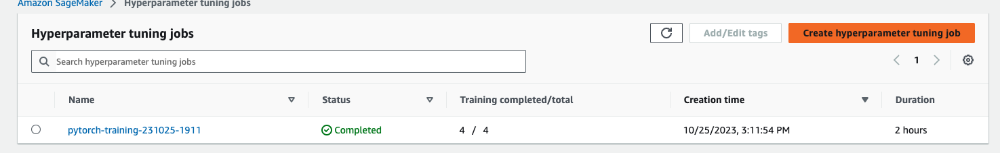
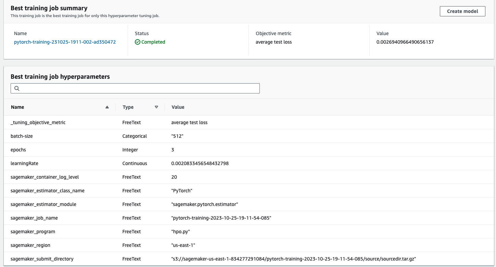
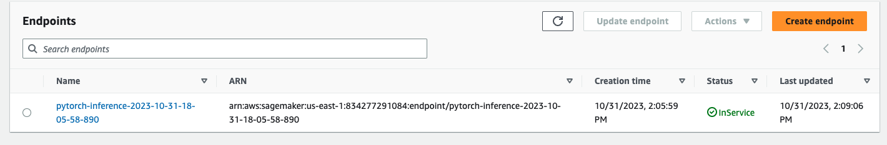

# Image Classification using AWS SageMaker

This project is an excercise in tunning a pretrained ResNet18 model off of a provided data set using hyperparameter tunning, debugging and profiling within the AWS echo system.  

## Project Set Up and Installation
Within an AWS env, setup a sagemaker instance and clone this project, from there you should be able to run each of the cells within train_and_deploy.ipynd and you should be able to reproduce results to a reasonable standard.

## Dataset
The provided dataset is the dogbreed classification dataset.


## Hyperparameter Tuning
In this section I am setting up the hyper parameter tunning job. I have decided to tune based on learning rate, batch size and the number of epochs the training job should run through (and defining the ranges that the job should search by). The job optomizes primarily upon the average test loss. The training functions along with the logs that the tunning job will optomize upon are produced by the hpo.py script file.

The screenshots of completed tunning jobs can be found here:




## Debugging and Profiling
After looking over the profiling report it was suggested a good way to improve results was to increase batch size. 

### Results
Results of the profiling of the model can be found in ProfilerReport/profiler-output/profiler-report.html


## Model Deployment
As you can see in the notebook in order to use the endpoint you simply need to open the image and feed it to the endpoints .predict function like so:
```
with open("./data/dogImages/sample_dog.jpg", "rb") as f:
    image = f.read()
    display(Image.open(io.BytesIO(image)))
    response = predictor.predict(image, initial_args={"ContentType": "image/jpeg"})
    print(f"Response: {response}")
    dog_breed = np.argmax(response, 1) + 1
```
Where dog_breed will be the predicted class of dog (the name can be seen by looking at the classes in the dataset.


